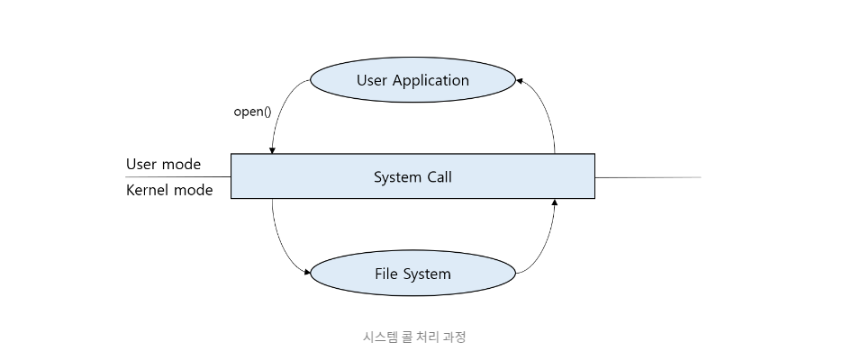

# 시스템콜

운영체제는 사용자 모드와 커널 모드로 나뉘어 동작하고, 이렇게 나뉘어 동작하는 것을 이중 동작 모드라고 합니다. 

사용자 모드는 접근할 수 있는 메모리 영역이 사용자에게 허용된 정도로 제한되어 있고, 하드웨어에 직접적으로 접근할 수 없습니다. 

커널모드는 모든 시스템 메모리와 CPU Instruction에 접근 가능하고, 하드웨어에 직접적으로 접근할 수 있습니다. 

즉, 커널 모드가 사용자 모드보다 높은 권한을 가져 사용자 모드에서 유저 애플리케이션의 필요에 따라 커널 모드로 변환하여 시스템 영역에 접근할 수 있습니다. 이렇게 사용자 모드에서 커널모드로 전환하기 위해 필요한 인터페이스를 시스템 콜이라고 합니다. 

---

## 시스템 콜 처리

1) 사용자 프로세스가 시스템 콜 호출 (커널 모드 진입)

2) 커널은 내부적으로 시스템 콜을 구분하기 위해 기능별로 고유번호를 할당하고 그 번호에 해당하는 제어 루틴을 정의

3) 커널은 요청받은 시스템 콜에 대응하는 고유번호를 확인하고 번호에 맞는 서비스 루틴 호출

4) 커널은 서비스 루틴을 처리하고, 사용자 모드로 전환

---

## 시스템 콜 종류

1. 프로세스 제어 (Process Control)
    - 끝내기(exit), 중지(abort)
    - 적재(load), 실행(execute)
    - 프로세스 생성(create process)
    - 프로세스 속성 획득과 속성 설정(get process attribute and set process attribute)
    - 시간 대기(wait time)
    - 사건 대기(wait event)
    - 사건을 알림(signal event)
    - 메모리 할당 및 해제 : malloc, free
2. 파일 조작 (File Manipulation)
    - 파일 생성 / 삭제 (create file / delete file)
    - 파일 열기 / 닫기 / 읽기 / 쓰기 (open / close / read / write)
    - 파일 위치 변경 (reposition)
    - 파일 속성 획득 및 설정 (get file attribute and set file attribute)
3. 장치 관리 (Device Manipulation)
    - 하드웨어의  제어와 상태 정보를 얻음
    - 장치를 요구, 장치를 방출 (request devices / release device)
    - 장치 읽기, 쓰기, 위치 변경
    - 장치 속성 획득 및 설정
    - 장치의 논리적 부착 및 분리 (attach / detach)
4. 정보 유지 (Information Maintenance)
    - 시간과 날짜의 설정과 획득 (time)
    - 시스템 데이터의 설정과 획득 (date)
    - 프로세스 파일, 장치 속성의 획득 및 설정
5. 통신 (Communication)
    - 통신 연결의 생성, 제거
    - 메시지의 송신, 수신
    - 상태 정보 전달
    - 원격 장치의 부착 및 분리
6. 보호 (Protection)
    - 권한 관리

---

## FORK()

- 자신과 똑같은 자식 프로세스를 만듭니다. 주로 유닉스 계열의 운영체제에 사용됩니다.
- 프로세스를 복제하기 때문에 누가 부모이고 자식인지 구별이 가지 않지만, return되는 pid가 0이면 자식, 0보다 큰 값일 경우 부모 프로세스의 pid로 리턴됩니다.
- 따라서 상태, 변수 및 PC 값은 동일하지만 pid로 구분합니다.

📚 출처

- https://c4u-rdav.tistory.com/85
- https://hojunking.tistory.com/48
- [https://velog.io/@qweadzs/CS-시스템-콜system-call](https://velog.io/@qweadzs/CS-%EC%8B%9C%EC%8A%A4%ED%85%9C-%EC%BD%9Csystem-call)
