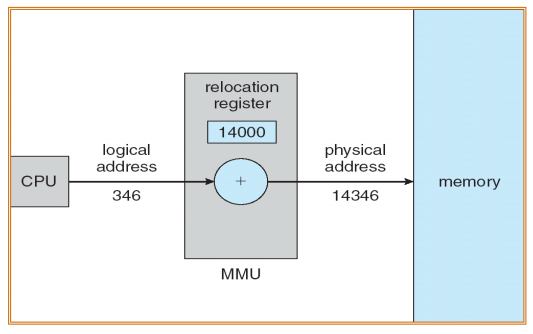

# 주소 변환

## 메모리 가상화

- **효율성과 제어를 바탕으로 CPU 가상화가 이루어짐**
- CPU 가상화에서 제한적 직접 실행(LDE)이라는 기법을 집중적으로 다룸
- **LDE** : 
    - CPU 가상화 대부분의 경우 프로그램은 하드웨어에서 직접 실행되지만 특정 순간(system call 발생 시, 타이머 인터럽트 발생 시)에 운영체제가 개입하여 문제가 발생하지 않도록 함
    - 운영체제는 약간의 하드웨어 자원만 받고 실행 프로그램에게 방해가 되지 않도록 노력함
    - 중요한 순간에 운영체제가 관여하여 하드웨어를 직접 제어

 

### 메모리 가상화의 목적

- 효율성 (efficiency)
    - 레지스터, TLB, 페이지 테이블 등 하드웨어의 지원 활용
- 제어 (control)
    - 응용 프로그램이 자기 자신의 메모리 외에 다른 메모리에 접근하지 못함을 운영체제가 보장
    - 프로그램을 다른 프로그램으로부터 보호하고 운영체제를 프로그램으로부터 보호하기 위하여 하드웨어 도움이 필요
- 유연성 (flexiiblity)
    - 프로그래머가 원하는 대로 주소 공간을 사용하고 프로그래밍하기 쉬운 시스템 만들기를 원함

 

**핵심 질문**

> 어떻게 효율적이고 유연하게 메모리를 가상화하는가

1. 어떻게 효율적인 메모리 가상화를 구축할 수 있을까?
2. 프로그램이 필요로 하는 유
연성을 어떻게 제공하는가?
3. 프로그램이 접근할 수 있는 메모리의 위치에 대한 제어를
어떻게 유지하는가?
4. 메모리 접근을 어떻게 적절히 제한할 수 있는가? 어떻게 이 모든
것을 효율적으로 할 수 있는가?
 
          
**-> 주소변환 기법 사용**

 

## 주소 변환

- **명령어 반입, 탑재, 저장 등의 가상 주소를 정보가 실제 존재하는 물리 주소로 변환**
- 프로그램의 모든 메모리 참조를 실제 메모리 위치로 재지정
- 운영체제는 메모리의 빈공간과 사용중인 공간을 항상 파악하므로서 메모리를 제어 가능
- 하드웨어는 가속화에 도움을 주고, 실질적인 메모리 가상화는 운영체제가 구현해야 함
- 따라서 운영체제는 메모리의 빈 공간과 사용 중인 공간을 항상 알고 있어야 하고 메모리 사용을 제어하고 관리
- 이 모든 작업의 목표는 프로그램이 자신 전용 메모리를 소유하고 그 안에 자신의 코드와 데이터가 있다는 환상을 만드는 것

 

### 주소 변환 요약

- **운영체제는 어떤 프로세스에게 CPU를 할당하여 실행시킬 때 그 프로세스의 시작 위치를 MMU의 재위치 레지스터에 셋팅**
- **이후 프로세스가 CPU에 의해 실행될 때 생성되는 논리 주소는 MMU에 의해 물리 주소로 변환**

 

### 주소 변환 가정

1. 프로세스는 연속적인 메모리 공간을 사용한다
2. 프로세스가 필요한 메모리는 항상 실제 메모리보다 작다
3. 모든 프로세스는 같은 크기의 메모리를 사용한다

 

### 동적(하드웨어 기반) 재배치

- 각 CPU마다 2개의 하드웨어 레지스터가 필요
    1. 베이스 레지스터
    2. 바운드 레지스터
- 두 레지스터는 우리가 원하는 위치에 주소 공간을 배치할 수 있게 해주는 동시에 프로세스가 오직 자신의 주소 공간에만 접근한다는 것을 보장
- 위 그림에서는 프로세스를 물리주소 32KB에 저장하기로 결정하고 베이스 레지스터를 이 값으로 지정
>physical address = virtual address + base
- 그 후 프로세스에 의해 생성되는 모든 주소가 위 방식으로 변환
- 하드웨어는 프로세스가 참조하는 가상 주소를 받아 데이터가 실제로 존재하는 물리주소로 변환
- 이 주소 재배치는 실행 시에 일어나고, 프로세스가 실행을 시작한 이후에도 주소 공간을 이동할 수 있기 때문에, 동적 재배치라고도 불림
- 바운드(한계) 레지스터의 경우 보호를 지원하기 위해 사용된
- 프로세서는 메모리 참조가 합법적인지 판단하기 위해 가상 주소가 바운드 범위 안에 있는지 확인
- 프로세스가 바운드보다 크거나 음수인 가상 주소를 참조하면 CPU의 예외와 함께 프로세스는 종료
- 베이스와 바운드 레지스터는 CPU칩 상에 존재하는 하드웨어 구조
- 주소 변환에 도움을 주는 프로세서의 일부를 메모리 관리장치 (Memory Management Unit, MMU)라 부르기도 함
- 바운드 레지스터는 가상주소를 바운드 레지스터와 비교하거나 먼저 베이스 레지스터를 더하고 그 결과가 바운드 안에 있는지 검사하는 방식으로 정의

 

### MMU (Memory Management Unit)
- 주소 변환을 해주는 하드웨어 장치
- 프로세스가 생성하는 논리주소에 재위치 레지스터(relocation register)의 값을 더해서 물리주소를 구함

 
