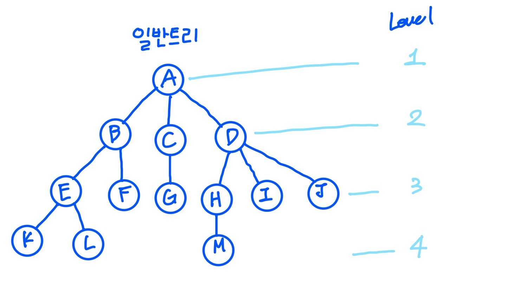

# 트리

한 노드 다음에 다음 노드 하나가 이어지는 선형구조와는 달리 한 항목 다음에 여러 개의 다음 노드가 오면서 계층적인 구조를 갖는다. 

하나 이상의 유한한 개수의 노드로 구성되며 반드시 근(Root) 노드부터 시작하여 노드와 노드의 관계는 가지(Branch)에 의해 표현된다. 

어떠한 두 노드 사이에도 사이클 존재하지 않는 연결그래프이다. 

---

## 트리 용어



- 근(Root) : A
- 단말노드(Leaf Node) : K, L, F, G, M, I, J
- 비단말노드 : A, B, C, D, E, H
- A의 차수 : 3, B의 차수 : 2, H의 차수 : 1
- 트리의 차수 : 3
- 높이, 깊이 : 4
- A는 B의 부모노드, B는 A의 자식노드
- B, C, D는 형제 노드
- 조상노드 : 루트 노드에서 임의의 노드까지의 경로를 이루고 있는 노드
- 후손노드 : 임의의 노드 하위에 연결된 모든 노드, 즉 어떤 노드의 서브 트리에 속하는 모든 노드들은 후손 노드이다.
- 단말노드 : 자식 노드가 없는 노드 ↔ 비단말노드
- 노드의 차수 : 어떤 노드가 가지고 있는 자식 노드의 개수(단말노드는 차수가 0)
- 트리의 높이 : 트리가 가지고 있는 최대 레벨

---

## 이진트리

1) 정의

- 모든 노드가 2개의 서브 트리를 가지고 있는 트리
- 서브 트리는 공집합일 수 있다. 따라서 이진트리의 노드에는 최대 2개까지의 자식 노드가 존재할 수 있고, 모든 노드의 차수가 2이하가 된다. (공집합도 이진 트리이다)
- 이진 트리에는 서브 트리간의 순서가 존재한다.

2) 성질

- n개의 노드를 가진 이진트리는 n - 1개의 간선을 갖는다.
- 높이가 h인 이진트리의 경우, 최소 h개의 노드를 가지며 최대 2^h - 1개의 노드를 가진다.
- 하나의 노드는 최대 2개의 자식을 가질 수 있으므로 레벨 i에서의 노드의 최대개수는 2^i-1이 된다. 따라서 전체 노드의 개수는 2^h -1이 된다.
- n개의 노드를 가지는 이진트리의 높이는 최대 n이 거나 최소 log(n + 1)이 된다.

3) 분류

- 포화이진트리
    - 트리의 각 레벨에 노드가 꽉 차있는 이진 트리
    - 높이 k인 포화 이진트리는 정확하기 2^k -1개의 노드를 가진다.
    - 포화이진트리에는 각 노드에 번호를 붙일 수 있다. 노드에 번호를 부여하는 방법은 레벨 단위로 왼쪽에서 오른쪽으로 번호를 붙이면 된다. 이 번호는 늘 일정하다.
- 완전이진트리
    - 높이가 k일때, 레벨 1부터 k - 1까지는 노드가 모두 채워져 있고 마지막 레벨 k에서는 왼쪽부터 오른쪽으로 노드가 순서대로 채워져 있는 이진트리
    - 포화 이진트리는 항상 완전 이진트리이지만 그 역은 항상 성립하지 않느다.

4) 표현법

- 배열을 이용한 방법
    - 인덱스 0은 사용하지 않음
    - 부모와 자식 인덱스 사이의 관계
        - 노드 i의 부모 노드 인덱스 = i / 2
        - 노드 i의왼쪽 자식 노드 인덱스 = 2 * i
        - 노드 i의 오른쪽 자식 노드 인덱스 = 2 * i + 1
- 링크 표현법
    - 포인터를 이용하여 노드와 노드를 연결
    - 하나의 노드가 3개의필드를 가진다. 데이터를 저장하는 필드와 왼쪽 자식 노드와 오른쪽 자식 노드를 가리키는 2개의 포인터 필드를 가진다. 이 2개의 포인터를 이용하여 부모노드와 자식 노드를 연결한다.
    - 루트 노드를 가리키는 포인터만 이으면 트리안의 모든 노드들에 접근 가능하다. 연결리스트와 유사하다. 연결 리스트는 1차원적인 연결된 구조라면 링크법으로 표현된 이진 트리는 2차원적으로 연결된 구조라 할 수 있다.
    - 노드들은 모두 동적 메모리 할당을 이용하여 생성되었다.

5) 이진트리의 순회

1) 전위순회(VLR)

루트 → 왼쪽 서브 트리 → 오른쪽 서브 트리

2) 중위순회(LVR)

왼쪽 서브 트리 → 루트 → 오른쪽 서브 트리

3) 후위순회(LRV)

왼쪽 서브 트리 → 오른쪽 서브 트리 → 루트

4) 레벨순회

각 노드를 레벨 순으로 순회

동일한 레벨인 경우 왼쪽에서 오른쪽으로 방문

*전위, 중위, 후위 순회는 스택을 사용한 순회법이고, 레벨 순회는 큐를 사용한 순회법이다.* 

---

## 이진트리 코드

```java
*Node.java*
****
public class Node {
	int value;
	Node left;
	Node right;

	public Node(int value) {
		this.value = value;
		this.left = null;
		this.right = null;
	}
}
```

```java
*BinararyTree.java*

public class BinaryTree {
	Node root;

	public void add(int value) {
		root = addRecursive(root, value);
	}

	public boolean fing(int value) {
		return findRecursive(root, value);
	}

	private Node addRecursive(Node current, int value) {
		if (current == null) {
			return new Node(value);
		}
		if (value < current.value) {
			current.left = addRecursive(current.left, value);
		} else if (value > current.value) {
			current.right = addRecursive(current.right, value);
		} else {
			return current;
		}
		return current;
	}
	private boolean findRecursive(Node current, int value) {
		if (current == null) {
			return false;
		}
		if (value == current.value) {
			return true;
		}
		return value < current.value
						? findRecursive(current.left, value);
						: findRecursive(current.right, value);
	}
}
```

```java
*중위순회의 dfs*

public List<Integer> dfsInOrder() {
	Stack<Node> stack = new Stack<>();
	List<Integer> result = new ArrayList<>();
	Node current = root;
	stack.push(root);
	while (!stack.isEmpty()) {
		while (current.left != null) {
			current = current.left;
			stack.push(current);
		}
		current = stack.pop();
		result.add(current.value);
		if (current.right != null) {
			current = current.right;
			stack.ush(current);
		}
	}
return result;
}
```

```java
*bfs로 노드를 순회하*

public List<Integer> bfs() {
	List<Integer> result = new ArrayList<>();

	if (root == null) {
		return result;
	}

	Queue<Node> nodes = new LinkedList<>();
	nodes.add(root);

	while (!nodes.isEmpty()) {
		Node node = nodes.remove();
		result.add(node.value);
		if (node.left != null) {
			nodes.add(node.left);
		}
		if (node.right != null) {
			nodes.add(node.right);
		}
	}
	return result;

}
```

---

## 면접질문

- BST(BinarySearchTree) 와 Binary Tree에 대해 설명해주세요
    - 이진트리는 자식노드가 최대 두 개인 노드들로 구성된 트리이고, 이진탐색트리는 이진 탐색과 연결 리스트를 결합한 자료구조 입니다.
    - 이진 탐색의효율적인 탐색 능력을 유지하면서, 빈번한 자료 입력과 삭제가 가능하닫는 장점이 있습니다.
    - 이진 탐색 트리는 왼쪽 트리의 모든 값은 반드시 부모 노드보다 작아야 하고, 오른쪽 트리의 값은 부모 노드보다 커야하는 특징이 있습니다.
    - 이진 탐색 트리의 탐색 연산은 트리의 높이에 영향을 받아 높이가 h일때 시간 복잡도는 O(h)이며, 트리의 균형이 한쪽으로 치우쳐진 경우 worst case가 되고 O(n)의 시간 복잡도를 가집니다. 이런 worst case를 막기 위해 나온 기법이 RBT(Red-Black Tree) 입니다.
- RBT(Red-Black Tree)에 대해 설명해주세요
    - RBT(Red-Black Tree)는 BST를 기반으로 하는 트리 형식 자료구조이며, RBT는 BST의 삽입, 삭제 연산 과정에서 발생할 수 있는 문제점을 해결하기 위해 만들어졌습니다.
    - BST를 기반으로 하기 때문에 당연히 BST의 특징을 모두 갖습니다.
    - 노드의 자식이 없는 경우, 자식을 가리키는 포인터는 NIL값을 저장합니다. 이러한 NIL들을 leaf node로 간주합니다.
    - 모든 노드를 빨간색 또는 검은색으로 색칠하며, 연결된 노드들은 색이 중복되지 않습니다.

📚 출처:

https://itcoin.tistory.com/479
https://dev-coco.tistory.com/159